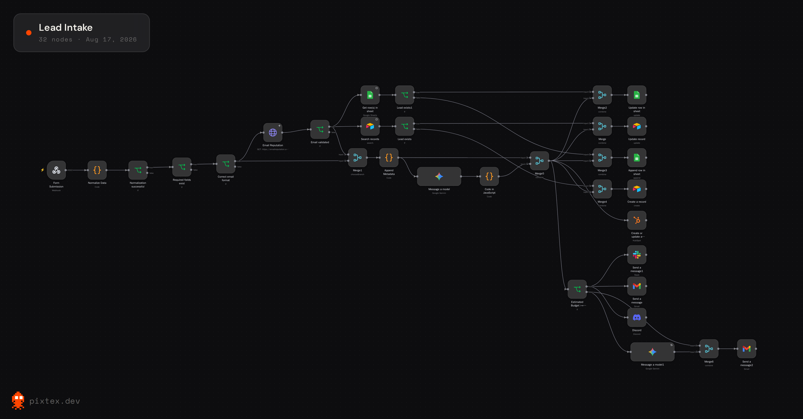

# 🤖 AI Lead Intake Automation with n8n

> A hands-on **n8n project** exploring workflow automation, webhooks, data normalization, validation, AI-powered lead qualification, CRM integrations, and automated notifications.



> **Note:** The screenshot above is intended to show the complete n8n workflow. Add an exported screenshot from your n8n editor at `docs/screenshots/workflow-overview.png`.

---

## 📌 About the Project

I built this project while learning **n8n** to understand how different services, APIs, business rules, and AI models can be connected into one automated workflow.

Instead of building a simple:

```text
Form → Email
```

workflow, I used the project to experiment with a more complete lead-processing pipeline:

```text
Form Submission
      ↓
Webhook
      ↓
Data Normalization
      ↓
Validation
      ↓
Email Reputation Check
      ↓
Duplicate Detection
      ↓
AI Lead Qualification
      ↓
CRM / Database Updates
      ↓
Notifications
      ↓
AI-generated Acknowledgment Email
```
---

## ✨ What It Does

The workflow receives incoming lead information and processes it automatically.

### 1. Multi-source lead intake

The webhook can normalize submissions from different form providers, including:

- **Tally**
- **Fillout**
- **Google Forms**

Each provider can send data in a different structure. The workflow converts those different payloads into a common internal lead format.

Example normalized fields:

```json
{
  "source": "Tally",
  "fullName": "John Doe",
  "email": "john@example.com",
  "phoneNumber": "+123456789",
  "companyName": "Example Inc.",
  "estimatedBudget": "5000",
  "message": "We need help automating our sales process."
}
```

---

## 2. Input validation

Before processing the lead, the workflow checks whether required information exists.

Examples include:

- Name
- Email
- Message

It also checks whether the email has a valid format.

Invalid submissions can therefore be stopped before they enter the rest of the pipeline.

---

## 3. Email reputation checking

The workflow can call an external email reputation service to check whether an email appears deliverable and whether it has risk indicators.

The workflow evaluates information such as:

- Email deliverability
- SMTP validity
- Disposable email status
- Address risk
- Domain risk

This helps prevent obviously problematic leads from being treated like normal leads.

> You will need your own API credentials for the email reputation service if you want to enable this part.

---

## 4. Duplicate lead detection

Before creating another lead record, the workflow checks existing records.

This is useful for preventing the same person from repeatedly creating duplicate CRM entries.

The current workflow uses Airtable and Google Sheets as part of its lead-storage/checking flow.

---

## 5. AI-powered lead qualification 🧠

One of the main learning goals was connecting an LLM to an automation workflow.

The workflow sends lead information to **Google Gemini** and asks the model to classify the lead as:

```text
LOW
MEDIUM
HIGH
```

The classification rules are based on factors such as:

- Urgency
- Budget
- Project detail
- Readiness to buy
- Buying intent

Example:

```json
{
  "priority": "High"
}
```

The AI output is parsed back into structured JSON so that it can be used by subsequent workflow nodes.

---

## 6. CRM and data integrations

The workflow demonstrates integrations with multiple business tools.

### Data / CRM

- Airtable
- Google Sheets
- HubSpot

### Communication

- Gmail
- Slack
- Discord

This was one of the main reasons for building the project: to learn how an automation platform can connect multiple independent systems together.

---

## 7. Automated notifications

High-value leads can trigger notifications to relevant communication channels.

For example:

```text
New high-priority lead

Name: John Doe
Company: Example Inc.
Budget: $5,000
Priority: HIGH
Source: Tally
```

This allows a team to react without manually checking the CRM.

---

## 8. AI-generated acknowledgment email

The workflow can also generate a professional acknowledgment email using Gemini.

The AI is instructed to:

- Thank the customer
- Acknowledge their inquiry
- Mention their project only when it can be summarized confidently
- Invite additional information
- Avoid inventing pricing, timelines, or technical details

This demonstrates how LLMs can be used for **controlled text generation inside an automation workflow**.

---

# 🏗️ Architecture

```text
┌───────────────────────────────┐
│       Lead Sources            │
│                               │
│ Tally │ Fillout │ Google Form │
└───────────────┬───────────────┘
                │
                ▼
       ┌─────────────────┐
       │     Webhook     │
       └────────┬────────┘
                ▼
       ┌─────────────────┐
       │ Normalize Data  │
       └────────┬────────┘
                ▼
       ┌─────────────────┐
       │    Validation   │
       │                 │
       │ Required fields │
       │ Email format    │
       └────────┬────────┘
                ▼
       ┌─────────────────┐
       │ Email Reputation│
       └────────┬────────┘
                ▼
       ┌─────────────────┐
       │ Duplicate Check │
       └────────┬────────┘
                ▼
       ┌─────────────────┐
       │ Gemini AI       │
       │ Lead Priority   │
       └────────┬────────┘
                │
       ┌────────┴──────────────┐
       ▼                       ▼
┌──────────────┐       ┌────────────────┐
│ CRM / Storage│       │ Notifications  │
│              │       │                │
│ Airtable     │       │ Slack          │
│ Sheets       │       │ Discord        │
│ HubSpot      │       │ Gmail          │
└──────────────┘       └────────────────┘
                │
                ▼
       ┌─────────────────┐
       │ AI Acknowledgment│
       │ Email           │
       └─────────────────┘
```

---

# 🧰 Tech Stack

| Technology | Purpose |
|---|---|
| **n8n** | Workflow automation |
| **Google Gemini** | AI lead qualification and email generation |
| **JavaScript** | Data transformation inside n8n |
| **Webhooks** | Receiving form submissions |
| **Airtable** | Lead storage / duplicate lookup |
| **Google Sheets** | Lead data storage |
| **HubSpot** | CRM integration |
| **Gmail** | Email communication |
| **Slack** | Team notifications |
| **Discord** | Team notifications |
| **Email Reputation API** | Email quality / deliverability checks |

---

# 🚀 How to Use It

If you want to run this workflow yourself, you can import the n8n workflow JSON and configure your own credentials.

## Requirements

You will need:

- A running **n8n** instance
- A Google/Gemini API credential
- Airtable account and API credentials
- Google Sheets access
- HubSpot credentials if you want the CRM integration
- Gmail credentials if you want automated emails
- Slack/Discord credentials if you want notifications
- Email reputation API credentials if you want email verification

You do **not** need every integration to experiment with the workflow. You can disable or remove the services you don't need.

---

## 1. Install / run n8n

You can use:

- n8n Cloud
- Docker
- npm
- A self-hosted n8n installation

Once n8n is running, open the n8n editor.

---

## 2. Import the workflow

In n8n:

1. Open your workspace.
2. Create/open a workflow.
3. Use **Import from File**.
4. Select:

```text
workflow/lead-intake.json
```

5. Review the nodes and connections.
6. Configure the credentials for your own services.

> The GitHub version should contain **sanitized credentials/placeholders only**. Never commit real API keys, OAuth tokens, webhook secrets, or private database identifiers.

---

# 🔐 Configuration

Before activating the workflow, configure the credentials for the services you want to use.

A useful approach is to create a small configuration checklist:

```text
[ ] Gemini credentials
[ ] Airtable credentials
[ ] Google Sheets credentials
[ ] HubSpot credentials
[ ] Gmail credentials
[ ] Slack credentials
[ ] Discord credentials
[ ] Email reputation API key
```

You should also replace any IDs from the original workflow with your own:

```text
YOUR_AIRTABLE_BASE_ID
YOUR_AIRTABLE_TABLE_ID
YOUR_GOOGLE_SHEET_ID
YOUR_HUBSPOT_CONFIGURATION
YOUR_SLACK_CHANNEL
YOUR_DISCORD_CONFIGURATION
```

---

# 📩 Sending a Test Lead

The workflow starts with an HTTP `POST` webhook.

A simple test payload can look like:

```json
{
  "Full Name": "John Doe",
  "Email": "john@example.com",
  "Phone Number": "+123456789",
  "Company Name": "Example Inc.",
  "Estimated Budget": "5000",
  "Message": "We are interested in automating our lead management process."
}
```

You can send this using:

- Postman
- Insomnia
- curl
- Python
- JavaScript
- A real form provider

Example with curl:

```bash
curl -X POST "YOUR_N8N_WEBHOOK_URL" \
  -H "Content-Type: application/json" \
  -d '{
    "Full Name": "John Doe",
    "Email": "john@example.com",
    "Phone Number": "+123456789",
    "Company Name": "Example Inc.",
    "Estimated Budget": "5000",
    "Message": "We are interested in automating our lead management process."
  }'
```

---

# 🔄 Example Workflow

A successful lead can move through the system approximately like this:

```text
John Doe submits form
        ↓
Webhook receives payload
        ↓
Data is normalized
        ↓
Required fields checked
        ↓
Email format checked
        ↓
Email reputation checked
        ↓
Existing lead searched
        ↓
Gemini analyzes lead
        ↓
Priority = HIGH
        ↓
Lead stored / CRM updated
        ↓
Team notified
        ↓
Acknowledgment email generated
        ↓
Customer receives email
```

---

# 📂 Repository Structure

```text
n8n-ai-lead-intake/
│
├── README.md
│
├── workflow/
│   └── lead-intake.json
│
├── examples/
│   ├── tally.json
│   ├── fillout.json
│   └── google-forms.json
│
├── docs/
│   └── screenshots/
│       └── workflow-overview.png
│
├── .gitignore
│
└── LICENSE
```

---

# ⚠️ Security

This repository is intended to be publicly viewable.

**Never commit:**

- API keys
- Passwords
- OAuth tokens
- Private webhook URLs
- Database credentials
- Personal customer information
- Production CRM identifiers
- Private email addresses

Before publishing the workflow, inspect the exported JSON carefully and replace sensitive configuration with placeholders.

---

# 🧪 Learning Goals

This project helped me explore several concepts:

### n8n

- Nodes
- Expressions
- Webhooks
- Conditional branches
- Merging data
- HTTP requests
- Credentials
- Workflow execution

### APIs

- Receiving webhooks
- Calling external APIs
- Processing API responses
- Connecting multiple SaaS platforms

### AI

- Prompt design
- Structured LLM output
- JSON parsing
- AI-assisted classification
- AI-generated communication

### Software Engineering

- Input normalization
- Validation
- Error handling
- Duplicate detection
- Separation of deterministic rules and AI decisions

---

# 🚧 Limitations & Future Improvements

This is a **learning project**, so it is not intended to be presented as a production-ready lead-management platform.

Potential improvements include:

- [ ] More robust schema validation
- [ ] Better error handling and retry logic
- [ ] Automated tests for incoming payloads
- [ ] Centralized configuration
- [ ] Better observability and logging
- [ ] More sophisticated lead scoring
- [ ] Human approval for sensitive actions
- [ ] Better duplicate-resolution logic
- [ ] Production deployment architecture
- [ ] More form providers
- [ ] Analytics dashboard
- [ ] Persistent audit trail

---

# 🎓 Why I Built This

I built this project primarily to **learn n8n**.

The goal was to move beyond individual tutorials and build something that connected several real-world concepts into one workflow.

It gave me practical experience with:

> **Automation → APIs → Data → AI → CRM → Communication**

This project is one step in my broader exploration of AI engineering and software systems.

---

# 📜 License

This project is licensed under the MIT License.

---

## ⭐ If you found this useful

Feel free to fork the repository, experiment with the workflow, and adapt it to your own lead-management process.
