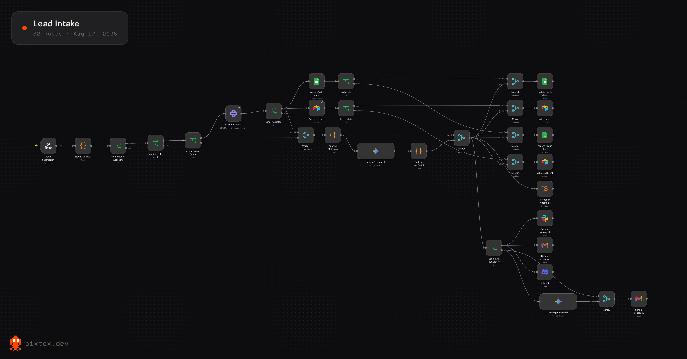
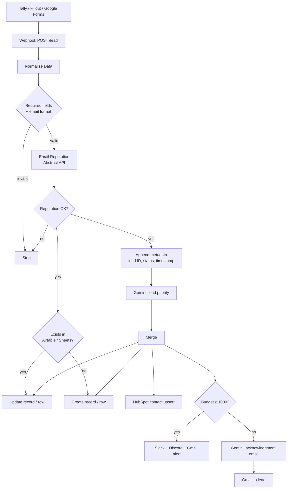
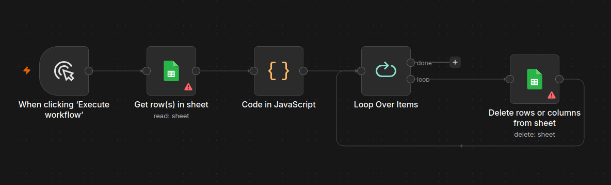

# AI Lead Intake Automation (n8n)



**Turns messy form submissions into validated, deduplicated, AI-prioritized leads in your CRM, so the sales team only reacts to real, high-value inquiries and every lead gets a fast reply.**

An [n8n](https://n8n.io) workflow that takes leads from Tally, Fillout or Google Forms. It cleans each lead, filters out bad or duplicate entries, scores it with Google Gemini, syncs it to Airtable, Google Sheets and HubSpot, then alerts the team or emails the lead.

---

## ✨ Key Features

- **Multi-source intake:** one webhook accepts Tally, Fillout and Google Forms payloads and normalizes them into a single lead schema.
- **Validation gate:** checks required fields (name, email, message) and email format before anything is stored.
- **Email reputation check:** uses Abstract API to check deliverability, SMTP validity, disposable addresses and domain risk.
- **Duplicate-safe storage:** looks up the email in Airtable and Google Sheets, then updates an existing record or creates a new one.
- **AI lead scoring:** Google Gemini labels each lead Low, Medium or High priority based on budget, urgency, detail and buying intent, and returns strict JSON.
- **CRM sync:** creates or updates the HubSpot contact with custom properties for budget, source, priority and status.
- **Budget-based routing:**
  - **Budget ≥ $1,000:** instant alerts to Slack, Discord and Gmail.
  - **Below $1,000:** Gemini writes a short, personalized acknowledgment email that avoids inventing pricing or timelines, and Gmail sends it to the lead.
- **Maintenance workflow:** a separate, manually run job removes duplicate rows from the Google Sheet.

---

## 🏗️ Architecture


```mermaid
flowchart TD
    A[Tally / Fillout / Google Forms] --> B[Webhook POST /lead]
    B --> C[Normalize Data]
    C --> D{Required fields<br/>+ email format}
    D -- invalid --> X[Stop]
    D -- valid --> E[Email Reputation<br/>Abstract API]
    E --> V{Reputation OK?}
    V -- no --> X
    V -- yes --> F[Append metadata<br/>lead ID, status, timestamp]
    F --> G[Gemini: lead priority]
    V -- yes --> H{Exists in<br/>Airtable / Sheets?}
    G --> M[Merge]
    H -- yes --> U[Update record / row]
    H -- no --> N[Create record / row]
    M --> U
    M --> N
    M --> S[HubSpot contact upsert]
    M --> R{Budget ≥ 1000?}
    R -- yes --> T[Slack + Discord + Gmail alert]
    R -- no --> AI[Gemini: acknowledgment email]
    AI --> GM[Gmail to lead]
```

---

## 🧩 Workflows

| Workflow | File | Trigger | Nodes | Purpose |
|---|---|---|---|---|
| Lead Intake | [`workflows/lead-intake.json`](workflows/lead-intake.json) | Webhook (`POST /lead`) | 32 | Validates, scores, stores and routes each new lead |
| Dedupe Cleanup | [`workflows/dedupe-cleanup.json`](workflows/dedupe-cleanup.json) | Manual | 5 | Finds rows with duplicate emails (trimmed, lowercased) in Google Sheets and deletes them |

<details>
<summary>Dedupe Cleanup screenshot</summary>



</details>

---

## 🧰 Tech Stack

| Category | Tools |
|---|---|
| Automation | n8n, JavaScript (Code nodes), Webhooks |
| AI | Google Gemini |
| Data / CRM | Airtable, Google Sheets, HubSpot |
| Notifications | Slack, Discord, Gmail |
| Validation | Abstract API (Email Reputation) |
| Form sources | Tally, Fillout, Google Forms |

---

## 🚀 Setup

1. **Run n8n.** Use n8n Cloud, Docker, npm or any self-hosted instance.
2. **Import the workflows.** In the editor, choose **Import from File** and select the JSON files in [`workflows/`](workflows/).
3. **Add credentials** for the services you want to use: Gemini, Airtable, Google Sheets, HubSpot, Gmail, Slack, Discord.
4. **Replace the placeholders** in the imported nodes:

   | Placeholder | Where |
   |---|---|
   | `YOUR_GOOGLE_SHEETS_ID` | Google Sheets nodes (both workflows) |
   | `YOUR_AIRTABLE_BASE_ID`, `YOUR_AIRTABLE_TABLE_ID` | Airtable nodes |
   | `YOUR_SLACK_CHANNEL_ID` | Slack node |
   | `YOUR_ABSTRACT_API_KEY` | Email Reputation (HTTP Request) node |
   | `YOUR_NOTIFICATION_EMAIL` | Gmail alert node |
   | `YOUR_COMPANY_NAME` | Gemini acknowledgment prompt |
   | `YOUR_CREDENTIAL_ID` | Re-select your own credential in each node |

5. **Match your data schema.** Your Airtable table, Google Sheet and HubSpot account need the fields the nodes map to, such as Lead ID, Full Name, Email, Estimated Budget, Priority and Status. HubSpot also needs the custom properties `estimated_budget`, `source`, `priority` and `status_of_lead`.
6. **Send a test lead:**

   ```bash
   curl -X POST "https://YOUR_N8N_HOST/webhook-test/lead" \
     -H "Content-Type: application/json" \
     -d '{"eventType":"FORM_RESPONSE","data":{"fields":[
           {"label":"Full Name","value":"John Doe"},
           {"label":"Email","value":"john@example.com"},
           {"label":"Company Name","value":"Example Inc."},
           {"label":"Estimated Budget","value":"5000"},
           {"label":"Message","value":"We need help automating our sales process."}]}}'
   ```

   This body uses the Tally format. The normalizer recognizes Tally, Fillout and Google Forms payloads.

You can disable any integration you don't need. Each storage and notification branch runs on its own.

---

## 📊 Project Status

**v1.0.0: complete as a learning and portfolio project.** I built it to learn n8n end to end: webhooks, branching, merges, HTTP APIs, credentials and structured LLM output. It works in my own n8n instance, but it has not been used or load-tested with real production traffic.

Possible next steps:

- Route alerts by AI priority as well as budget.
- Add error-workflow alerts.
- Add example payloads for each form provider.

---

## 📂 Repository Structure

```text
n8n-ai-lead-intake/
├── README.md
├── LICENSE
├── workflows/
│   ├── lead-intake.json
│   └── dedupe-cleanup.json
└── docs/
    └── screenshots/
        ├── lead-intake.png
        └── dedupe-cleanup.png
```

---

## 👤 Author

**Abdul Rafay**

- LinkedIn: [linkedin.com/in/abdurafay19](https://www.linkedin.com/in/abdurafay19)
- GitHub: [github.com/abdurafay19](https://github.com/abdurafay19)

Open to n8n and AI automation work. Feel free to reach out.

---

## 📜 License

[MIT](LICENSE) © 2026 Abdul Rafay
